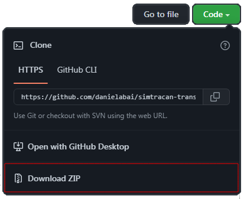

---
其他語言閱讀：[English](README.md) · [Español](README.sp.md) · [简体中文](README.zh-s.md) · [繁体中文](README.zh-t.md)
---
## 🀄 Simtracan 翻譯

**Simtracan Translator** 是一款翻譯軟件（在其 0.1.3 版本中）可以在簡體中文、繁體中文、普通話拼音、粵語、粵語拼音、中文注音和中文 Unicode 字符之間進行翻譯。

該軟件由 Daniela Bai (Daniela Barazarte) 用 Python 開發，其主要目標是翻譯中文的多種派生文本，不受字符限制，無廣告，翻譯效果好，同一翻譯器有多種選擇。

現在它能夠翻譯大部分漢字，因為它包含一個超過 18.000 漢字的圖書館。

### 動機

大約兩年前，我開始學習普通話，因為我對這門語言很感興趣，所以我找了一些夥伴一起練習，其中一位是廣東女孩，開玩笑說她用粵語發短信。

在提高我的中文水平的同時，我還通過一些 Youtube 教程學習了 Python，並願意將所學知識付諸實踐，所以……以前我找不到好的翻譯人員可以將粵語翻譯成簡體中文來理解我夥伴的信息 ，為什麽不自己建呢？ 于是想到了 Simtracan Translator。

一開始很難，考慮到我對編程方面很陌生，而且根本不擅長粵語，但即便如此我還是決定構建它。

我啓動了這個項目，並決定將其稱為“Simtracan Translator”，因為它包括簡體中文、繁體中文和粵語。 現在我很高興展示這個項目。

## 🚀 安裝

###先決條件

Python 3.x.x

他的軟件使用的唯一附加庫是 Regex，它在大多數 Python 版本中都是默認的。

> 版本 1.2.0 之後使用 Tkinter
>

### 安裝

1. 下載這個存儲庫的 ZIP



1.解壓你下載的ZIP
2.自由使用Simtracan Translator
     - 您可以在 0.1.3 版本上使用 Python 模塊模式
     - 您可以在 0.2.0 版本上使用 .exe（Python GUI）模式

## 💻 用法

### ❗請注意

請注意，Simtracan Translator 的軟件可能包含技術或印刷錯誤。 此外，Simtracan Translator 不保證軟件中出現的翻譯是准確和/或完整的。

---

### Python模塊模式

- 打開你的 Python 終端/控制台
- 添加你需要的版本的文件夾
- 運行代碼
     - 如果您在此步驟中遇到問題/錯誤，請[聯系我](simtracan-translator%20819d2e8f30024ea3833e508558ff7bee.md)
- 開始按照說明進行操作

**解釋**

*（這是0.1.3版本的解釋，不同版本作用相似）*

您需要輸入要翻譯的文本

> 軟件會自動檢查您輸入的正則表達式文本
>

選擇一個數字，告訴您輸入的文字是什麽語言

選擇其他號碼並選擇您希望接收翻譯的語言。

> 如果你選錯了一個選項，或者你選擇了同一種語言兩次，軟件會顯示一個錯誤信息並讓你選擇一個選項（你有3次嘗試正確選擇選項）
>

收到您的翻譯

### Python GUI mode

- 打開 .exe
     - 如果您在此步驟中遇到問題/錯誤，請[聯系我](simtracan-translator%20819d2e8f30024ea3833e508558ff7bee.md)
- 使用翻譯器

**解釋**

使用交互式界面，您將需要要翻譯的文本。 您可以將文本粘貼到文本區域，或從計算機上的文件中獲取。

您還可以檢查您輸入的文本。

> 它會統計你的文字有多少個字，還會告訴你是拼音還是漢字
>

然後您必須在選項菜單中選擇您輸入的文本是什麽語言。

在其他選項菜單中選擇您想要接收翻譯的語言

單擊“翻譯”並接收您的翻譯

> 如果您選擇了錯誤的選項，或者您選擇了兩次相同的語言，軟件將顯示錯誤消息並讓您重新選擇一個選項
>

通過將翻譯保存到可以是 .txt 或 .html 的文件來保存您的翻譯

## 📄 代碼

### 詞彙表

| 縮寫 | 全詞 | 含義 |
| --- | --- | --- |
| FL 或 lang_A | 第一語言或語言A | 是您將用來輸入要翻譯的文本的語言 |
| SL 或 lang_B | 第二語言或語言 B | 是軟件將選擇生成翻譯的語言 |
| 1 或 SM | 簡體中文 | 普通話簡體字- 普通話簡體字|
| 2 或以舊換新 | 繁體中文 | 普通話繁體字- 中文繁體字| 簡體中文
| 3 或 MP | 普通話拼音 | 普通話拼音- 普通話拼音字母|
| 4 或 C | 粵語 | 廣東話/粵語- Cantonese Chinese (廣東方言) characters |
| 5 或 CP | 粵語拼音 | 粵拼 - 粵語拼音 (Jyutping) 字母 |
| 6 或 CZ | 中國注音 | ㄅㄆㄇㄈ - 中文注音 (Bopomofo) |
| 7 或銅 | 中文統一碼 | 中文統一碼 - Chinese Chacter Encoding |

### 詳細解釋

即使不同版本的工作方式略有不同，該軟件的一般工作方式是您輸入要翻譯的文本，然後選擇該文本的語言 (lang_A)，然後選擇您想要該文本的語言 待翻譯（lang_B），然後它會為您顯示翻譯。

```python
#----------- stage 1
# Input from the user
user_input = "為" 

# Comment about the text user input
OUTPUT: "The text you input: \- Contain Hanzi \- Contains (1) character"

#----------- stage 2
# Selection from the user
from_lang = "1" # tranlation from Simplified Mandarin
to_lang = "2" # translation to Traditional Mandarin

#----------- stage 3
# Final Translation
OUTPUT: "Translation complete: 為"
```

- **Stage 1: Text input**
    
    When you input the text, it is automatically checked by a Regex Formula that will tell whether the text you input has Chinese Characters, Latin Script or Zhuyin, so it can try to guess in what language is the text you input.
    
    - (code)
        
        ```python
        # Example of user input
        user_input = "為"
        
        # Text checker is a checker that will automatically check a text and tell wether it has Chinese Characters, Latin Script or Zhuyin
        def text_checker(user_input):
            hanzi_list = "[\u4e00-\u9fff]+" # Hanzi (Chinese Characters) unicode list
            latin_list = "[\0000-\u007F]+" # Latin Script unicode list
            zhuyin_list = "[\u3100-\u31A0]+" # Zhuyin unicode list
        
            textLength = len(user_input) - 1 # checker of how many letters/character a text have
        
            if (re.search(hanzi_list, user_input)):
                print("The text you input: \- Contain Hanzi \- Contains (", textLength, ") characters")
                return("")
            else:
                pass
            if (re.search(zhuyin_list, user_input)):
                print("The text you input: \- Contain Zhuyin characters \- Contains (", textLength, ") characters")
                return ("")
            else:
                pass
            if (re.search(latin_list, user_input)):
                print("The text you input: \- Contain letters of Latin Script \- Contains (", textLength, ") letters")
                return ("")
            else:
                pass
        
        ```
        
- **Stage 2: Selection of lang_A and lang_B**
    
    When you select in what language is the text you input (lang_A) it will output/show the option you selected. Same case when you select in what language is the text you input (lang_B) it will output/show the option you selected
    
    A function will save your selection of lang_A and your selection of lang_B, this way will know what dictionary to use (langA_to_langB)
    
    - (code)
        
        ```python
        # Input from the user
        user_input = "為"
        
        # Selection from the user
        from_lang = "1" # in what language is the text user input
        to_lang = "2" # in what language user will receive the translation
        
        # Option Selection for languages
           if from_lang == '1' and to_lang == '2': # 1 is Simplified Mandarin, 2 is Traditional Mandarin
               translate_text = (get_translation(user_input, simplified2traditional_dictionary)) # it saves the text the user input and selects the dictionary for languages
               print("Translation done:")
               return(translate_text) # returns the text
        ```
        
- **Stage 3: Translation between lang_A and lang_B**
    
    Then the will pick the text you input and every single character/word will be replaced from the lang_A to lang_B by the .replace() method.
    
    - (code)
        
        ```python
        # Input from the user
        user_input = "為"
        
        # Example of dictionary
        simplified2traditional_dictionary = {'為':'為'}
        
        # Get translation
        def get_translation(user_input, dictionary): # will take the text from the user and also the dictionary that will be used for the translation
            for word, replace in dictionary.items(): # will replace every single character of the user input to one that it can finds in the dictionary
                text = text.replace(word, replace)
            return(text)
        ```
        
    
    The result of the .replace() will be output/show for you
 
## 💯 使用的資源

我使用了多種資源來使這個軟件工作，特別是在創建用于翻譯的字符詞表時我需要多種資源，所以我將它們標記在這裏。

**簡體中文詞彙表**

- [**萬字詞表**](https://www.chinese-forums.com/forums/topic/42692-spreadsheet-of-10000-most-frequent-chinese-words-2397-characters/#replyForm) ([中文論壇](https://www.chinese-forums.com/), [用戶麻雀](https://www.chinese-forums.com/profile/53860-sparrow/))
- **[中文漢字大全](http://www.ku51.net/hanzi/hanzi1.html)** ([KU51.net](http://www.ku51.net/))

**繁體字表**

- [**中文轉換簡體<>繁體字**](https://www.lexilogos.com/keyboard/chinese_conversion.htm) ([lexilogos.com](https://www.lexilogos.com/))
- **[簡體繁體字轉換器](http://www.ku51.net/)** ([KU51.net](http://www.ku51.net/))

**中文普通話拼音詞表**

- [**拼音轉換聲調標記 <> 數字](https://www.lexilogos.com/keyboard/pinyin_conversion.htm)** ([lexilogos.com](https://www.lexilogos.com/))
- **[中文拼音轉換器](http://www.meetmandarin.com/resources/pinyin-converter.html)** ([meetmandarin.com](http://www.meetmandarin.com/))

**中文粵語及粵語拼音詞表**

- [**粵語轉粵拼轉換器**](https://www.branah.com/cantonese-to-jyutping) ([branah.com](https://www.branah.com/))
- **[漢字→廣東話/粵語拼音轉換工具](https://hongkongvision.com/tool/cc_py_conv_zh)** ([hongkongvision.com](https://hongkongvision.com/tool/cc_py_conv_zh))

**中國注音詞表**

- [注音符豪/Bopomofo](https://omniglot.com/chinese/zhuyin.htm) ([omniglot.com](https://omniglot.com/chinese/zhuyin.htm))

**中文 Unicode 字表**

- [**中文轉 Unicode**](https://www.chinese-tools.com/tools/converter-unicode.html) ([chinese-tools.com](https://www.chinese-tools. com/))

---

我在 Excel 文件中輸入了所有單詞列表，但由于我需要將其從 Excel 文件轉換為 Python 中的字典，因此我使用了 [PANDAS](https://pandas.pydata.org/) 庫來完成 它

## 🆙 版本曆史

### 0.2.0

> 發表于 2022 年 10 月 31 日
>

**主要改進**

- **Python GUI/Tkinter 庫**

（加上0.1.3版本特性）

### 0.1.3

> 發表于 2022 年 10 月 31 日
>

**主要改進**
- 能翻譯20000個最常用的漢字
- 添加新語言：
     - 中國注音
     - 中國統一碼
  
**其他改進**
     - 更好地檢查輸入文本（漢字、拉丁字母或注音）
     - 創建使用更少空間的翻譯系統
     - 更清晰的翻譯功能
     - 更好的翻譯系統
     - 更幹淨、更輕便的代碼

（加上0.1.2版本特性）

### 0.1.2

> 發表于 2022 年 10 月 12 日
>

**主要改進**
- 能翻譯12000個最常用的漢字

**其他改進**
     - 輸入文本的檢查器（漢字或非漢字）
     - 更好的翻譯功能
     - 更幹淨、更輕便的代碼
     - 添加 OOP 概念

（加上0.1.1版本特性）

### 0.1.1

> 發表于 2022 年 10 月 4 日
>
- 第一個初始版本
- **Python 模塊軟件**
- 能翻譯8000個最常用的漢字
- 能夠翻譯成：
     - 簡體中文
     - 繁體中文
     - 普通話漢語拼音
     - 廣東話
     - 粵語拼音

## 🌱 計劃未來

我計劃專注于其他項目，但我對這個項目仍有一些想法，例如：

- 更准確的翻譯
- 文字轉語音
- 更多中國方言
- 語音識別和輸入

和別的！

### 貢獻

如果您想貢獻一些東西，報告問題或添加功能，我們完全歡迎您！

### 支持

如果我的項目對您有幫助，請星標 ⭐ 這個存儲庫！

## ©️ 許可證

**麻省理工學院許可證** - Simtracan 翻譯 - Daniela Bai - 2022年

## 👩🏼‍💻 作者

Daniela Bai (Daniela Barazarte)

- Twitter [@danielabai8](https://twitter.com/@danielabai8)
- Github [@danielabai](https://github.com/danielabai/)

### 特別感謝

感謝我的朋友 **Marco Aurelio L**。 為我的代碼提供積極的反饋，為我提供項目的建議和新想法。 感謝我來自廣東的中國夥伴**Avery**（不知不覺中）給了我這個想法。 感謝我的**媽媽**以及在這個項目期間一直支持我的任何其他人。 還要感謝我為了完成這個項目而遵循的教程！

感謝 **FreeCodeCamp** 和他們的教程：

- [Python 入門教程](https://www.youtube.com/watch?v=rfscVS0vtbw)
- [Tkinter GUI 初學者課程](https://www.youtube.com/watch?v=YXPyB4XeYLA)

感謝 **[Bro Code](https://www.youtube.com/c/BroCodez)** 和他的教程：

- [Python 入門教程](https://www.youtube.com/watch?v=XKHEtdqhLK8)
- [Tkinter GUI 初學者課程](https://www.youtube.com/watch?v=TuLxsvK4svQ)


<p align="center">

</p>
