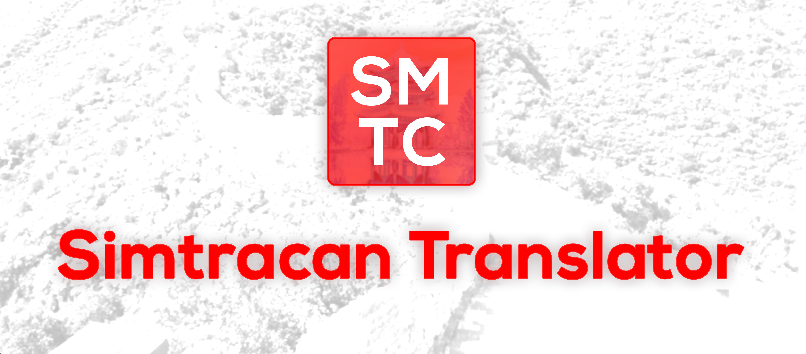

# version 0.1.1



## 🀄 Simtracan Translator

**Simtracan Translator** is a translation tool that can translate between Mandarin Chinese Simplified, Mandarin Chinese Traditional, Mandarin Chinese Pinyin, Cantonese and Cantonese Pinyin, via Python Console

You can use it whenever you want to translate text using only the python console, the result can become accurate, and it can also provide Pinyin translation for both Mandarin and Cantonese. It's a great tool when you want a translation from a different source. The software can automatically translate the most common 8,000 Chinese characters without any character limit per translation.

This first version was made from September 24, 2022 to October 4, 2022.

### Motivation

Almost two years ago I started to learn Mandarin Chinese and since I am so interested in the language I found some partners to practice with, one of them was a girl from Guangdong who, to play a joke on me, texts messages in Cantonese.

While improving my Chinese, I was also learning Python through a Youtube tutorial ([FreeCodeCamp, Full Course for Beginners Python](https://www.youtube.com/watch?v=rfscVS0vtbw)) and was willing to putting the knowledge into practice so…as before I couldn't find good translators who could give the translation from Cantonese to Simplified Mandarin to understand my partner's messages, why not build it myself? and that's how Simtracan Translator came to mind.

It was hard at first, considering that I am very new to the programming aspect and not good at Cantonese at all, but even with that I decided to build it.

I started the project and made the decision to call it “Simtracan Translator” as it includes **Sim**plified, **Tra**ditional and **Can**tonese Chinese. Now I am very excited to show this project.

## 🚀 Installation

### Pre-requisites

No pre-requisites, only Regex Library that comes as default in Python.

### Installation

1. Clone the script called: "simtracan_translator_pythonfile.py" that is inside of this repository
2. Execute the Python script

## 💻 Usage

- Run the code
- Select the 'first language' you want to use from the 5 language options
    - Simplified Mandarin
    - Traditional Mandarin
    - Mandarin Pinyin (not available at the moment as selection of first language)
    - Cantonese
    - Cantonese Pinyin (not available at the moment as selection of first language)
- Select the 'second language' you want to use from the other 3 language options
    - Both Mandarin Pinyin and Cantonese Pinyin are available to be used as a "second language"

> If you select an option incorrectly, the software will display an error message and will not continue
> 

> If you select the same option twice, the software will display an error message and will not continue
> 
- Enter the text you want to translate from 'first language' to 'second language'

> If the text you enter does not have Chinese characters, the software will display an error message and will not continue
> 
- Receive your translation

Of course, as the software is new it may have problems, but I'll keep working on it.

## 📄 Code

### Glossary

- **First language**: is the language you will use to input the text you want to translate
- **Second language**: is the language that the software will choose to generate the translation
- **SM**: **S**implified **M**andarin
- **TM**: **T**raditional **M**andarin
- **MP**: **M**andarin **P**inyin
- **C**: **C**antonese
- **CP**: **C**antonese **P**inyin

### Structure


### Logical Explanation


**First Stage:**


Depending on the first language you want to use for the translation, the other options you can use for the second language will be displayed.

```python
# If you select 1. Simplified Mandarin as your option it will output:

# Output:
Now you can select any of the next languages:
✎2- Traditional Mandarin Chinese
✎3- Mandarin Chinese Pinyin
✎4- Cantonese Chinese
```

Both Mandarin Chinese pinyin and Cantonese pinyin are not available for selection as a "first language" at this time


**Second Stage:**


Based on the languages you selected, it will allow you to enter the text you want to translate and the text you enter will go to a created function.

```python
if first_language == "Simplified Mandarin Chinese" and second_language == "Mandarin Chinese Pinyin":
    print(function_language2language(input(
        "\nPlease, input the text you want to translate from Simplified Mandarin Chinese to Mandarin Chinese Pinyin\n")))
```

There is a specific function for each variation between languages. Here is an example of one of them.

```python
def function_language2language(function_language2language_input):
    chinese_characters = "[\u4e00-\u9fff]+"
    if (re.search(chinese_characters, function_language2language_input)):
        for key, value in language2language_dict.items():
            function_language2language_input= function_language2language_input.replace(key, value)
        print(translation_done)
        return (function_language2language_input)
    else:
        return (error_found)
```

The text you input will be checked, the regex function will check whether or not it has Chinese characters

```python
# Regex Function: Checks if a text has chinese characters or not
chinese_characters = "[\u4e00-\u9fff]+"
(re.search(chinese_characters, function_language2language_input)):
```

If your text does not have Chinese characters, it will display an error message (`"》ERROR: The text you input does not have Chinese characters. Please try again《"`), but if it has Chinese characters, it will call the replace method.


**Third Stage:**


The replace method will automatically replace the input text from 'language A' to 'language B' by replacing the keys with values it can find in a dictionary

```python
# Replace key and value, replace the input text for the keys/values of a ditionary
for key, value in language2language_dict.items():
            function_language2language_input= function_language2language_input.replace(key, value)
        print(translation_done)
        return (function_language2language_input
```

For this to work, there are different dictionaries that represent keys (the character you input) and values (the character that will do the replacement) and that will do a quick replacement when generating the result.

```python
# Dictionary suit for replacement
language2language_dict = {'个':'個'}
# 个 being a "key"
# 個 being a "value"
```

After completing the process, it will return the translation successfully.

## 💯 Features

To make the dictionaries for the characters and their replacement, I used:

A [[10000 character word list].](https://www.chinese-forums.com/forums/topic/42692-spreadsheet-of-10000-most-frequent-chinese-words-2397-characters/#replyForm) I edited it removing the duplicates and the result was around 8000 characters.

- Since I needed the Cantonese translation, I used some resources including [HongKong Vision](https://hongkongvision.com/tool/cc_py_conv_en) and [Tradukka](https://tradukka.com/translate) to get the translation. in Cantonese and Cantonese pinyin

Since I needed to pass the Excel word list to the Python list, I used the following code using the Pandas library.

```python
import pandas as pd
file = pd.read_excel(r'file_path/file_name.xlsx')

print(file.to_dict('split'))
```

And i also used the bloc editor to replace values (`’, ‘` to `’: ‘` and `], [` to `,`  ) so they could be suitable as a Dictionary

## 🌱 Future Plan

Since it's a very simple python console project, I plan to improve it as I improve my experience as a software engineer.

### Contribution

If you want to contribute something, report problems or add features, you are totally welcome!

### Support

Star ⭐ this repository if my project helped you!

### Version history

- 0.1
-Initial version

## 👤 Author

Daniela Bai (Daniela Barazarte)

- Twitter @danielabai8
- Github @danielabai

### Special thanks

A special thanks to my Chinese partner from Guangdong Avery, also to my friend Marco Aurelio L. for giving me feedback on my code and giving me the recommendation of adding Regex.

Also a special thanks to FreeCodeCamp for posting such a helpful tutorial for Python!
